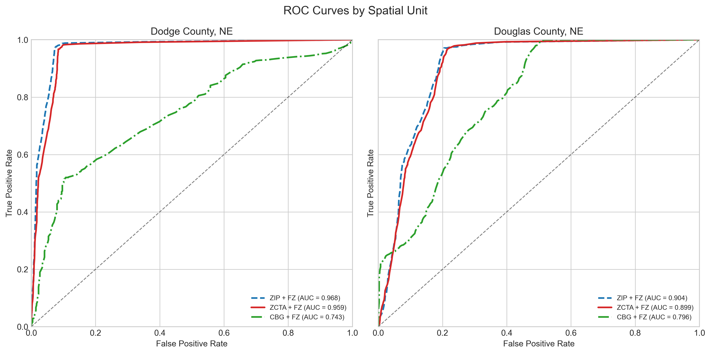
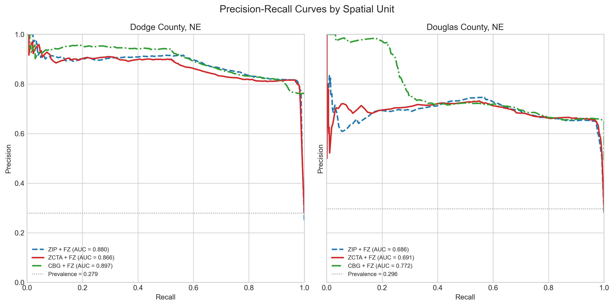
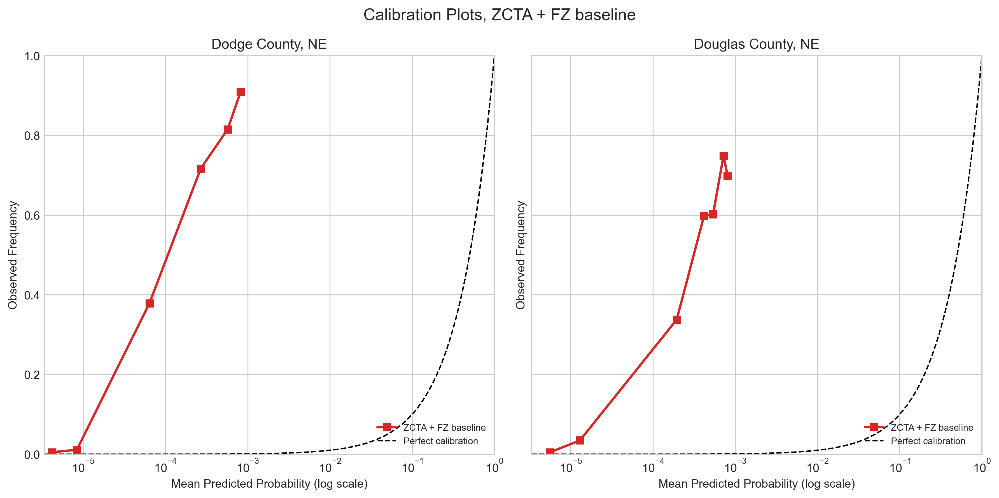
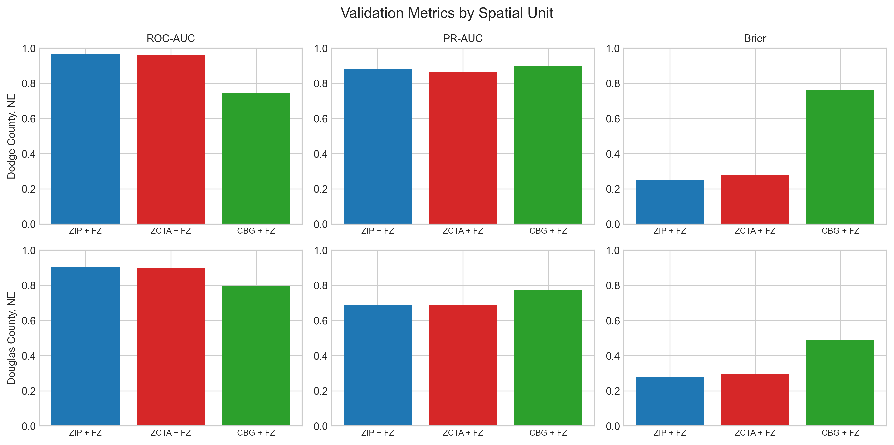
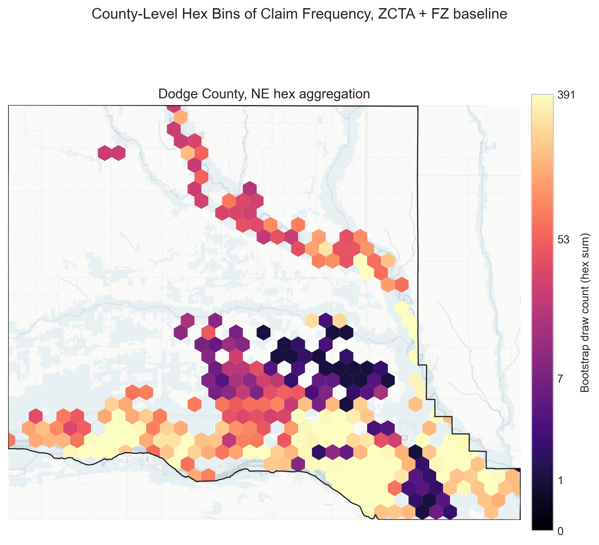
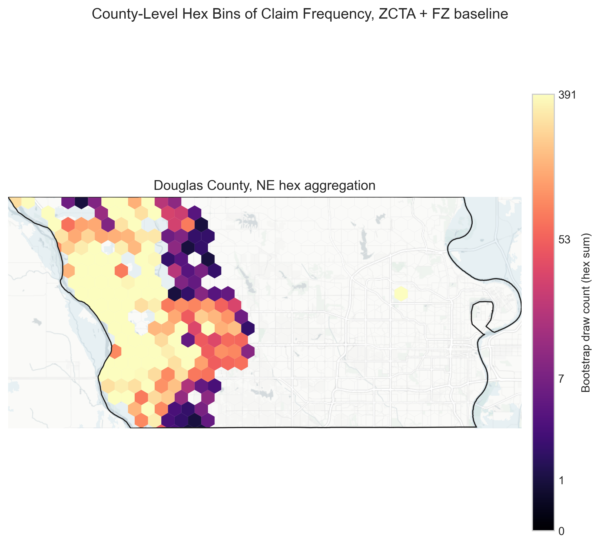
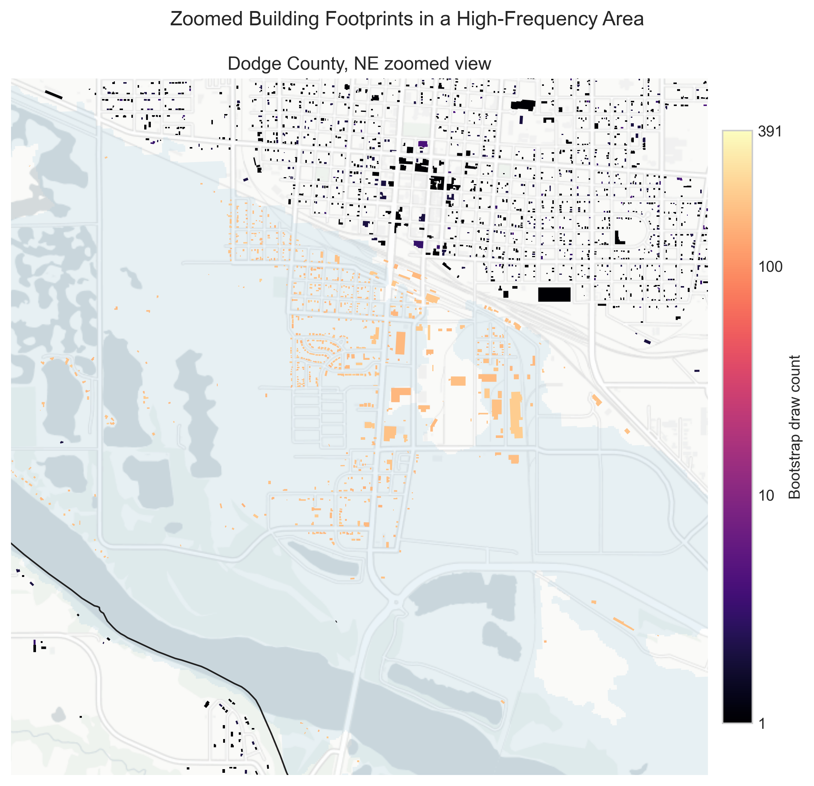
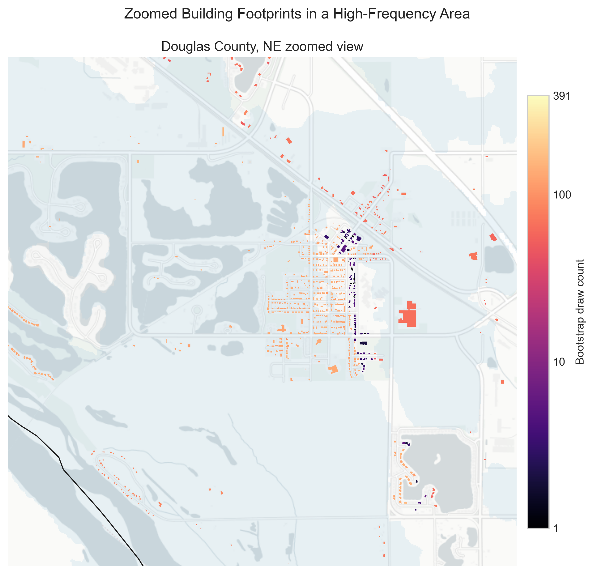

Running title: Disaggregating Flood Claims

Manuscript word count: approximately 4,900 words, excluding references, tables, figures, and appendix.

# Introduction {#sec-introduction}

Flooding generates over \$17 billion in annual economic damage in the United States, ranking as one of the most destructive and pervasive natural hazards confronting communities nationwide [@armal2020]. A March 2019 flood in eastern Nebraska exemplifies this challenge: an unprecedented event that impacted thousands of properties across multiple states, resulting in substantial financial losses and federal disaster declarations [@crs2019]. In the aftermath of these types of events, understanding which structures sustain flood damage is critical for effective risk management and targeted mitigation strategies.

The National Flood Insurance Program (NFIP), which serves as a vital source for national flood-loss data, anonymizes and aggregates records to preserve policyholder confidentiality. Consequently, planners, emergency managers, and researchers must often rely on aggregated spatial units, substantially limiting their ability to accurately pinpoint and analyze highly localized patterns typical of flood losses. To address this data gap, we introduce an ensemble-based probabilistic spatial disaggregation method specifically designed to link anonymized NFIP claims to individual building footprints. Our approach combines principles from probabilistic record linkage and bootstrap resampling to allocate aggregated claim records to specific structures in a statistically appropriate manner. Rather than replacing existing modeled inundation datasets, our method complements them by integrating actual NFIP claims, thereby offering a more complete picture of flood impacts and enabling identification of previously overlooked micro-hotspots of flood damage.

## National Flood Insurance Program {#sec-nfip}

The NFIP, launched in 1968 when private coverage was scarce, now provides flood insurance to millions of properties [@michelkerjan2010; @fema_flood_insurance]. To safeguard policyholder privacy, the Federal Emergency Management Agency (FEMA) releases redacted public claim data that omit precise building coordinates and direct policyholder identifiers [@fema_openfema_claims]. This privacy protection curtails use of the dataset by planners and researchers who need structure-level loss information to target mitigation. March 2019 flooding in Nebraska exposed this gap: damage spanned multiple jurisdictions, yet the public NFIP file does not reveal building-level data on policy claims. To address these limitations, we propose a probabilistic method that reallocates anonymized claims to individual footprints, bridging the divide between privacy protection and actionable risk assessment.

## Current Approaches and Limitations {#sec-limitations}

Current approaches to flood risk assessment offer valuable but incomplete insights into flood impacts. The First Street Foundation [@fsf2023] provides detailed property-level flood-risk modeling that estimates flood depths and assigns risk ratings from modeled hazard information. Similarly, we independently derived a detailed flood extent map using remote sensing data. These high-resolution modeled and remotely sensed datasets identify properties that may have experienced flooding, but neither directly captures dimensions of insured financial losses; they cannot indicate which specific buildings submitted NFIP claims or quantify the magnitude of those losses. These limitations in current approaches create an opportunity for methodological innovation in spatial disaggregation of the NFIP data. The challenge lies in developing a method that can reliably connect anonymized claims to specific structures while quantifying the inherent uncertainty in this process.

## Research Objectives and Questions {#sec-objectives}

To address this challenge, our research focuses on developing and validating an ensemble-based spatial disaggregation method through three core questions:

1. How do spatial-unit choices such as ZIP Code Tabulation Area (ZCTA), ZIP, and census block group (CBG), together with attribute filters like flood zone, elevation, and construction year, affect claim assignment accuracy, and which configurations yield robust performance?

2. How well do the disaggregated claim assignments align with observed inundation data across two counties, and which conditions influence performance?

3. What practical insights do these building-level likelihoods provide for local floodplain managers and researchers when precise claim locations are unavailable?

# Literature Review {#sec-literature}

## Spatial Disaggregation {#sec-lit-disaggregation}

Methods of spatial disaggregation have evolved from early dasymetric maps into modern ensemble frameworks that leverage progressively richer ancillary data and represent uncertainty more explicitly. Wright [-@wright1936] first refined population densities by distinguishing inhabited from uninhabited land, and Tobler's [-@tobler1979] pycnophylactic interpolation introduced volume-preserving smoothing between zones. Subsequent areal-interpolation work by Goodchild and Lam [-@goodchild1980] and Goodchild et al. [-@goodchild1993] formalized proportional transfer across intersecting polygons, establishing the baseline "areal-weighting" paradigm. Multi-class dasymetric studies then sharpened these surfaces with satellite land-cover and parcel attributes [@langford1994; @fisher1996; @yuan1997; @eicher2001; @mennis2006]. Recent reviews emphasize opportunities to use a wider range of areal features and ancillary datasets in spatial interpolation [@comber2019]. As researchers sought to quantify error, ancillary data were embedded in expectation-maximization, regression or geostatistical models [@flowerdew1994; @kyriakidis2004; @wu2005], and Bayesian or copula-based schemes propagated variance across scales [@bradley2016; @custer2018]. More recently, hybrid approaches that combine dasymetric, geostatistical, and machine learning components have been developed to improve disaggregation accuracy [@patil2024].

## Probabilistic Record Linkage {#sec-lit-linkage}

Fellegi and Sunter's classic model [-@fellegi1969] cast record linkage as a classification problem, weighting field agreements with m- and u- probabilities and setting decision thresholds that still anchor modern practice. Later refinements improved both estimation and scalability: Jaro [-@jaro1989] and Winkler [-@winkler1988] introduced the EM algorithm to infer agreement probabilities from data, while Winkler [-@winkler2000] and Herzog et al. [-@herzog2007] surveyed blocking, indexing, and advanced string metrics that enable large-scale implementations.

Building on this foundation, mixture-model, Bayesian, and machine learning approaches treat match status as latent, estimate model-based or posterior match probabilities, and propagate linkage uncertainty through downstream analyses [@fortini2001; @larsen2001; @larsen2005; @tancredi2011; @sadinle2017]. Open-source toolkits such as fastLink and Splink combine probabilistic weighting with supervised learning and distributed computing to link millions of administrative records efficiently [@enamorado2019; @linacre2022]. Probabilistic linkage is especially critical in spatial applications where datasets lack unique identifiers: recent work, for example, links overlapping LiDAR tree inventories while jointly modelling positional error and growth dynamics [@drew2025], and similar methods underpin studies in geographic epidemiology and historical map reconciliation. Across these use cases, Bayesian and machine learning linkers not only improve match quality but, crucially, provide an explicit confidence measure for every candidate pair, information we later propagate through our flood-claim disaggregation ensemble.

## Bootstrap Sampling and Uncertainty Quantification {#sec-lit-bootstrap}

Bootstrapping was introduced by Efron [-@efron1979] as a method to quantify uncertainty without strong parametric assumptions. By repeatedly resampling the data and recalculating results, one can empirically estimate the sampling distribution of almost any statistic. This approach, later popularized by Efron & Tibshirani [-@efron1993], provides confidence intervals and error estimates, and it has become a staple for error propagation in applied statistics [@davison1997], including spatial analysis. A key advantage to this approach is its flexibility; bootstraps can be applied to complex spatial models where analytic error formulas are intractable.

This ensemble approach shares methodological parallels with bootstrap aggregating (bagging), introduced by Breiman [-@breiman1996]. Both approaches rely on creating multiple bootstrap samples and aggregating their outcomes to produce robust estimates with quantified uncertainty; bagging typically targets predictive accuracy in classification and regression, whereas the present implementation addresses probabilistic spatial record linkage under anonymization constraints.

## Error Propagation in Spatial Analysis {#sec-lit-error}

Many spatial researchers have adopted bootstrap and related Monte Carlo methods to gauge the reliability of spatial predictions. For example, Heuvelink [-@heuvelink1998] detailed techniques for stochastic error propagation in GIS, laying groundwork for using resampling to assess uncertainty in map outputs. In practice, this means treating input data or model residuals as samples to generate multiple plausible realizations of the data or model output. Applications range from interpolated surfaces to location-allocation models. One hydrology study illustrates this well: Zhang et al. [-@zhang2018] use a bootstrap approach to quantify how uncertainty in rainfall measurements translates into uncertainty in modeled runoff. They resampled rain gauge data to produce numerous rainfall maps, ran each through a hydrological simulation, and then examined the spread of the resulting streamflow predictions. This bootstrapping of inputs revealed the sensitivity of flood modeling to rain spatial patterns and provided error bounds for the simulations. Similarly, in spatial epidemiology and ecology, moving-block bootstraps are used when data are spatially autocorrelated.

## Flood Risk Assessment and NFIP Claims Data {#sec-lit-flood}

Analyses of NFIP claims have been crucial for understanding flood loss patterns. For example, Highfield et al. [-@highfield2013], after examining repetitive flood-loss claims in Harris County, Texas, questioned the adequacy of the 100-year floodplain as a comprehensive risk metric. They found that substantial losses occur outside officially mapped high-risk zones, highlighting the limitations of relying solely on regulatory maps for risk assessment. In a subsequent nationwide analysis, Kousky and Michel-Kerjan [-@kousky2015] examined more than one million NFIP claims from 1978 through 2012 and distilled six key findings about flood insurance losses. They documented patterns such as concentration of repetitive losses, the distribution of claims between major events, and chronic flooding. This extensive data analysis established a clearer understanding of flood loss characteristics, revealing key principles such as a small fraction of properties accounting for a large share of claims.

### Spatial Risk Modeling with Claims {#sec-lit-spatial}

Researchers have increasingly used claims and loss data alongside flood-hazard information to evaluate risk maps and planning conditions. Blessing et al. [-@blessing2017] evaluated the proportion of losses captured by current flood-hazard delineations; by overlaying historical claims on flood maps they showed that a notable portion of damage occurs outside designated floodplains, suggesting that official maps under-represent true risk. Brody et al. [-@brody2014] combined land-use data with NFIP claims and found that surrounding land-use and land-cover conditions were associated with observed insured flood losses. Related work on the built environment, wetlands, policy learning, and Community Rating System incentives links planning and mitigation programs to flood-loss outcomes [@brody2008; @brody2009; @zahran2010]. On a national scale, Wing et al. [-@wing2018] fused an advanced flood-hazard model with exposure data to estimate present and future flood risk across the conterminous United States, finding substantially more people at risk than suggested by regulatory floodplain maps.

Wagner [-@wagner2022] uses NFIP insurance-market data to study adaptation and adverse selection in disaster insurance markets. The present study extends this line of work to building-level matching with explicit uncertainty quantification.

### Probabilistic Loss Estimation {#sec-lit-probabilistic}

A notable recent advance is the move toward probabilistic methods in flood risk assessment. Traditional approaches used deterministic depth-damage curves; however, studies leveraging NFIP claims have revealed large variability. Wing et al. [-@wing2020], using more than two million NFIP claims, estimate empirical flood vulnerability functions and show substantial dispersion in loss outcomes at similar flood depths, motivating probabilistic rather than purely deterministic damage modeling. In line with this, McGrath et al. [-@mcgrath2019] developed probabilistic depth-damage curves for flood-induced building losses, representing damage as a distribution rather than a single deterministic estimate. Additionally, Dottori et al. [-@dottori2016] present INSYDE, a synthetic probabilistic flood-damage model that incorporates explicit cost components and uncertainty in damage estimation. These probabilistic approaches allow risk managers to calculate metrics like exceedance probability curves for losses or the likelihood of insurance portfolio outcomes under various scenarios.

In summary, the literature shows substantial advances in spatial disaggregation, probabilistic record linkage, and methods for uncertainty quantification such as bootstrap sampling and ensemble techniques. Concurrently, research utilizing NFIP claims data highlights both its immense value and the persistent challenges posed by data aggregation for fine-scaled flood risk assessment. While these fields offer powerful tools, a critical need remains for a method that integrates these approaches to probabilistically disaggregate anonymized flood claims to individual building footprints while rigorously quantifying the inherent uncertainties.

# Data and Methods {#sec-methods}

## NFIP Data {#sec-data-nfip}

The OpenFEMA NFIP claims file [@fema_openfema_claims] provides anonymized claim records with reported ZIP codes, flood-zone information, basic property attributes, and coarse coordinates, along with census identifiers. Each record carries a unique record identifier that supports dataset management without revealing policyholder locations. We focus on residential claims for the March 2019 event in Dodge and Douglas counties. Reported ZIP codes are treated as ZCTA identifiers for claims, while buildings are assigned ZCTA via TIGER/Line polygons. We do not use the coarse coordinates or census identifiers in the baseline because their spatial precision is limited; these fields are evaluated in sensitivity analyses. The March 2019 Nebraska case is used because statewide parcel data and an event-specific inundation footprint are available, enabling building-level validation; comparable inundation layers are not available for other candidate events in this study.

We do not attempt multi-event replication because event-specific inundation layers and contemporaneous building-stock data are not available for other candidate events, limiting comparable validation outside 2019.

We also use the OpenFEMA policies file [@fema_openfema_policies] to characterize insurance coverage and compare policy-derived spatial distributions with claim-derived distributions for the same event window. Policies are not disaggregated in the main algorithm; they are used to contextualize candidate pools and penetration rates.

For external validation, we use the OpenFEMA Housing Assistance Owners dataset [@fema_openfema_housing_assistance] to compare ZIP-level claim likelihoods with FEMA housing assistance totals for disaster 4420 (2019). We also use 2019 American Community Survey (ACS) ZCTA housing and income estimates [@census_acs_2019] to contextualize policy uptake.

In this analysis, NFIP records are integrated with ancillary datasets, including the Microsoft building footprint [@microsoft2018] and supplementary geographic data such as USGS 3DEP elevation. These additional data sources provide the necessary context for disaggregating the claim records into building-based estimates. Thus, by applying a probabilistic matching framework that leverages shared spatial characteristics such as flood zone, census block, and building type, we can refine the allocation of claims to potential building locations. This integrated approach not only mitigates the limitations imposed by the aggregated nature of the NFIP data but also enables subsequent spatial analyses, such as the calculation of Moran's I and hotspot detection.

## Building Footprint Data {#sec-data-buildings}

The Microsoft Building Footprints dataset provides the core spatial framework for linking aggregated NFIP claims to individual structures. This dataset comprises high-resolution building polygons generated via computer-vision techniques applied to satellite imagery, encompassing both urban and rural areas of eastern Nebraska. While the base dataset includes only building geometries, we enhance it with Nebraska statewide parcel-assessor records from 2023, which are proprietary and available for purchase from the State of Nebraska. These records provide structural characteristics such as land-use/classification codes, assessed improvement values, parcel ZIP codes, and year of construction. These attributes support the largest-building-per-parcel filter and the construction-year sensitivity test described below. Microsoft Building Footprints were selected for their statewide coverage and compatibility with parcel joins; alternative structure datasets such as the National Structures Inventory or FEMA structures could be substituted in future applications.

Each building footprint was assigned a unique identifier and linked to its corresponding attributes in a unified database, thereby aligning structural details with the building's precise location. This integration step was especially critical for the subsequent probabilistic matching of aggregated NFIP claims to potential building candidates. By incorporating attributes such as building value or construction year, the matching algorithm could better narrow the set of candidate structures for each claim group, improving the fidelity of the final disaggregation. Ultimately, these enriched building footprints serve as the essential spatial reference points for modeling how NFIP claims are distributed at the level of individual structures.

## Event-Specific Inundation Layer {#sec-data-inundation}

To create an observed flood footprint for validation, we refined the flood-inundation polygon provided by the Nebraska Department of Natural Resources [@nednr2019] using additional imagery and manual review to capture recession areas outside the original boundary. The refined footprint preserves the major inundation signatures while better reflecting areas that were recently flooded but no longer water-covered at the time of observation. For robustness, we tested performance under modest spatial uncertainty around the footprint boundary and found that discrimination metrics were effectively unchanged. Comparable inundation layers are not available for other events in this study, so ROC/PR evaluation is limited to the 2019 event.

## Data Sources and Versions {#sec-data-sources}

| Dataset | Source | Year / version | Key attributes | Notes |
|---|---|---|---|---|
| NFIP claims | OpenFEMA [@fema_openfema_claims] | March 2019 event | reported ZIPs, flood-zone information, elevation, coarse coordinates, census identifiers | Dodge and Douglas counties |
| NFIP policies | OpenFEMA [@fema_openfema_policies] | In-force March 2019 | reported ZIPs, flood zones, policy counts | used for coverage context |
| FEMA housing assistance | OpenFEMA [@fema_openfema_housing_assistance] | Disaster 4420 (2019) | ZIP-level registrations and assistance totals | external validation |
| Flood hazard (National Flood Hazard Layer, NFHL) | FEMA NFHL [@fema_nfhl] | latest panels for Dodge and Douglas | flood-zone and Special Flood-Hazard Area (SFHA) indicators | flood-zone matching |
| Building footprints | Microsoft Building Footprints [@microsoft2018] | 2018 release | building polygons | joined to parcels |
| Parcel assessor data | Nebraska statewide parcels | 2023 | construction year, assessed value, parcel ZIP | building attributes |
| ZCTA boundaries | U.S. Census TIGER/Line [@census_zcta_2022] | 2022 | ZCTA polygons | building ZCTA assignment |
| Census block groups | U.S. Census TIGER/Line [@census_cbg_2020] | 2020 | block group polygons | sensitivity analysis |
| ACS housing/income | U.S. Census ACS 5-year [@census_acs_2019] | 2019 | housing counts, tenure, income | policy uptake context (ZCTA) |
| Elevation | USGS 3DEP [@usgs_3dep] | tiles covering study area | elevation and slope | terrain sensitivity |
| Inundation footprint | Nebraska DNR + Sentinel-2 [@nednr2019] | March 2019 | flood extent | validation layer |

## Geographic and Flood-Zone Distribution {#sec-data-distribution}

Flood-zone designations provide critical context for understanding the risk environment of affected properties. Most claims fall inside the SFHA, with a smaller share outside mapped floodplains. Policies in force indicate that SFHA penetration is well below full coverage when compared to the candidate building stock. Because Zone X records do not include base flood elevation values, the elevation filter can be enforced for most SFHA records but not for Zone X claims and policies, which must rely on coarser spatial constraints.

## Methodological Framework {#sec-methods-framework}

Our approach employs a three-stage probabilistic framework that transforms aggregate-level claim data into building-specific probability distributions. This methodology systematically narrows potential building matches while quantifying the inherent uncertainty in claim allocation.

The first stage establishes logical groupings of NFIP claims that share key spatial and structural attributes, such as reported ZIP and flood zone. Claims with identical attribute combinations are grouped together, maintaining the fidelity of the original data while reducing computational complexity. This grouping mechanism facilitates efficient parallel execution during subsequent stages, as each constraint group can be evaluated independently.

Following grouping, we identify candidate buildings for each claim through a hierarchical filtering process that progressively narrows potential matches. We focus on residential buildings and, for the baseline configuration, retain a single building per parcel: the structure with the highest assessed value, used as a proxy for the primary insured building. We refer to this as the largest-building-per-parcel filter throughout. We then apply spatial constraints to include only buildings within the same ZCTA and flood zone as the claim, harmonizing flood-zone labels for consistency. Optional filters include elevation, construction-year tolerance, assessed-value tolerance, slope, and distance-to-SFHA for outside-floodplain claims. Each filter is applied only when relevant fields are available and only if it does not eliminate all candidates, ensuring claims with limited ancillary data still yield matches.

Unless otherwise noted, the analyses that follow use a parsimonious baseline configuration: largest building per parcel with ZCTA and FEMA flood-zone matching. This configuration balances discrimination, calibration, and interpretability and serves as the reference specification for all sensitivity experiments.

## Bootstrap Assignment {#sec-methods-bootstrap}

Instead of deterministically selecting a single most likely match for each claim, our methodology employs a bootstrap sampling procedure. This approach inherently generates an ensemble of results by recalculating across multiple samples. For every NFIP claim (policy $p$), we perform $n$ independent draws with replacement from its pool of candidate structures, selecting one candidate structure per draw. We set $n = 1000$ draws per claim throughout this study. Candidates are sampled uniformly after filtering; filters constrain the candidate set rather than impose a ranking rule. The collection of these $n$ draws for each claim constitutes the bootstrap ensemble.

The primary output of this stage is a dataset of raw bootstrap selection counts, structured as a building $\times$ claim $\times$ count matrix. These per-claim selection counts indicate how many times each candidate building $b$ was drawn for a given NFIP policy $p$ during the $n$ bootstrap iterations performed for that policy. The algorithm subsequently uses these counts to derive measures of claim likelihood. These raw counts represent the model's foundational output, prior to the normalization and aggregation steps detailed below, and can be used to develop various analytical products to meet specific research or practical needs.

For the primary building-level validation in this study, these raw counts are aggregated across all matched claims. We sum the per-policy bootstrap selection counts $c_{p,b}$ for each building across all policies $p$ for which it was a candidate, yielding a total aggregated bootstrap count $C_b^{agg}$ for that building; see the Appendix for the full mathematical formulation. We then normalize by the total number of draws across all matched claims, $n \times N_{\text{matched}}$, to obtain a building-level likelihood score:

$$L_b = C_b^{agg} / (n \times N_{\text{matched}})$$ {#eq-likelihood}

where $N_{\text{matched}}$ is the number of claims with at least one viable candidate. This score can be interpreted as an index of evidence reflecting the strength and consistency of a building's selection across the relevant claims, rather than a formal probability in the classical sense. The resulting scores are used to compute discrimination and calibration statistics in @sec-results.

## Naive Spatial Aggregation Baselines {#sec-methods-baselines}

To effectively benchmark our model, we first estimated four naive models in which every structure within a coarse spatial unit receives the same claim probability. Spatial units were defined (1) by ZCTA and (2) by the intersection of ZCTA with FEMA flood-zone boundaries; each definition was applied to all mapped buildings and, separately, to only the largest building on each parcel.

For a unit $g$ containing $N_g$ buildings and $C_g$ recorded claims, the probability $P_b$ assigned to any specific building within that unit is calculated as:

$$P_b = C_g / N_g$$ {#eq-naive}

This ratio is the expected number of claims per building in the unit, equivalently a uniform per-building claim rate; it approximates the probability that a building is associated with at least one claim only when that rate is small.

| Spatial Constraints | Building Selection | ROC-AUC | PR-AUC | Brier Score | Log-Loss |
|---------------------|-------------------|---------|--------|-------------|----------|
| ZCTA | All Buildings | 0.812 | 0.491 | 0.096 | 0.627 |
| ZCTA | Largest Building | 0.829 | 0.501 | 0.056 | 0.454 |
| ZCTA + FZ | All Buildings | 0.857 | 0.733 | 0.090 | 0.994 |
| ZCTA + FZ | Largest Building | 0.868 | 0.722 | 0.049 | 0.542 |

: Naive Model Results: Dodge County, March 2019 {#tbl-naive}

## Sensitivity and Robustness Tests {#sec-methods-sensitivity}

Beyond the baseline ZCTA+flood-zone configuration, we conduct focused sensitivity tests to address data and specification uncertainties. We compare spatial units such as ZIP, ZCTA, and census block group, evaluate whether coarse OpenFEMA latitude/longitude can further constrain candidate pools, test construction-year tolerances, and assess slope and distance-to-SFHA filters intended to improve matching for outside-floodplain claims. We also compare the spatial distribution of bootstrapped claim likelihoods to distributions derived from in-force NFIP policies to contextualize coverage and penetration. External validation aggregates building-level likelihoods to ZIPs and compares them to FEMA Housing Assistance Owners totals for disaster 4420 (2019) using Pearson and Spearman correlations. Finally, we stratify claims by total payment to assess sensitivity to loss-size heterogeneity. These tests hold the largest-building-per-parcel filter constant unless otherwise noted.

# Results {#sec-results}

## Baseline Performance and Candidate Pools {#sec-results-performance}

Using the baseline ZCTA+flood-zone configuration with the largest-building-per-parcel filter, the model matches nearly all claims in both counties. Candidate pools are large but tractable, and thousands of buildings receive nonzero probability in each county.

Validation against the inundation footprint indicates strong discrimination for the baseline ZCTA+flood-zone configuration, with the area under the receiver operating characteristic curve (ROC-AUC) at 0.959 in Dodge and 0.899 in Douglas and the area under the precision-recall curve (PR-AUC) at 0.866 and 0.691, respectively. Because PR-AUC depends on class prevalence, Table @tbl-pr-adjusted reports PR-AUC normalized by prevalence, defined as PR-AUC divided by prevalence, for the baseline model; the normalized lift remains higher in Dodge but indicates separation in both counties.

| County | PR-AUC | Prevalence | PR-AUC / prevalence |
|---|---:|---:|---:|
| Dodge | 0.866 | 0.279 | 3.108 |
| Douglas | 0.691 | 0.296 | 2.333 |

: Prevalence-adjusted PR comparison (baseline ZCTA+FZ) {#tbl-pr-adjusted}

Note: Ratios are computed from unrounded prevalence (Dodge 0.2787; Douglas 0.2962); displayed prevalence is rounded to three decimals.

Figure @fig-roc-curves presents receiver operating characteristic curves for the baseline and sensitivity variants in Dodge and Douglas Counties, highlighting differences in discrimination. Figure @fig-pr-curves provides the corresponding precision--recall curves, emphasizing performance under class imbalance. Figure @fig-calibration reports decile-based calibration for the baseline model with log-scaled predicted probabilities, and Figure @fig-metric-comparison compares ROC-AUC, PR-AUC, and Brier scores across spatial-unit variants.

Although the bootstrap model improves discrimination over the naive spatial baselines (ROC-AUC 0.959 versus 0.868 for the ZCTA and flood-zone largest-building naive model in Dodge; @tbl-naive), its Brier score is higher (0.278 versus 0.049), reflecting a calibration cost from concentrating probability mass on fewer candidate buildings.

{#fig-roc-curves}

{#fig-pr-curves}

{#fig-calibration}

{#fig-metric-comparison}

## Spatial Likelihood Surfaces {#sec-results-maps}

Figure @fig-hex-dodge maps county-level hex aggregations of bootstrap draw counts for Dodge County with the inundation footprint overlay, and Figure @fig-hex-douglas provides the corresponding view for Douglas County. Figure @fig-zoom-dodge zooms to a high-frequency area in Dodge County to show building-footprint detail relative to the inundation footprint, and Figure @fig-zoom-douglas provides the same building-level view for Douglas County. Together these views emphasize spatial clustering along mapped floodplains and channel-adjacent corridors.

{#fig-hex-dodge}

{#fig-hex-douglas}

{#fig-zoom-dodge}

{#fig-zoom-douglas}

## Spatial-Unit Sensitivity {#sec-results-spatial}

Table @tbl-spatial-units compares spatial-unit choices while holding other filters constant. ZCTA performs comparably to ZIP and avoids temporal instability in ZIP boundaries. Census block groups increase precision--recall in some cases but reduce ROC-AUC and calibration, indicating a narrower candidate pool that can over-concentrate probabilities.

| County | Variant | Matched claims | ROC-AUC | PR-AUC | Brier |
|---|---|---:|---:|---:|---:|
| Dodge | ZIP + FZ | 239 | 0.968 | 0.880 | 0.250 |
| Dodge | ZCTA + FZ | 239 | 0.959 | 0.866 | 0.278 |
| Dodge | CBG + FZ | 231 | 0.743 | 0.897 | 0.761 |
| Douglas | ZIP + FZ | 178 | 0.904 | 0.686 | 0.281 |
| Douglas | ZCTA + FZ | 178 | 0.899 | 0.691 | 0.296 |
| Douglas | CBG + FZ | 176 | 0.796 | 0.772 | 0.491 |

: Spatial-Unit Sensitivity Results {#tbl-spatial-units}

## Latitude/Longitude and Construction-Year Sensitivity {#sec-results-latlon}

OpenFEMA latitude/longitude fields are rounded to 0.1 degrees and often fall outside county boundaries (5 of 240 Dodge claims; 44 of 183 Douglas claims). When used as a strict filter, discrimination declines in Douglas (ROC-AUC 0.870). A weighted approach that down-weights distant candidates performs comparably to the ZCTA baseline (ROC-AUC 0.969 in Dodge; 0.911 in Douglas), but does not improve calibration enough to justify inclusion in the baseline.

Construction-year matching is also sensitive to data coverage. Exact-year matching substantially reduces performance (ROC-AUC 0.629 Dodge; 0.693 Douglas), while a +/-5-year tolerance yields performance comparable to baseline (ROC-AUC 0.963 Dodge; 0.904 Douglas). Given incomplete year coverage in Dodge County parcel data, construction year is retained as a sensitivity test rather than a core constraint.

## Topographic and SFHA-Distance Filters {#sec-results-topo}

We evaluate two additional covariates to improve matches outside mapped floodplains: a slope threshold (<=2 degrees) derived from 3DEP elevation and a distance-to-SFHA threshold (<=500 m) applied only to Zone X claims. Table @tbl-covariates shows that slope filtering modestly improves discrimination and precision--recall in both counties, while the SFHA-distance filter yields limited or mixed changes in aggregate metrics.

| County | Variant | Matched claims | ROC-AUC | PR-AUC | Brier |
|---|---|---:|---:|---:|---:|
| Dodge | ZIP + FZ | 239 | 0.968 | 0.880 | 0.250 |
| Dodge | ZIP + FZ + slope <= 2° | 239 | 0.969 | 0.889 | 0.244 |
| Dodge | ZIP + FZ + dist <= 500 m (Zone X) | 239 | 0.954 | 0.880 | 0.333 |
| Douglas | ZIP + FZ | 178 | 0.904 | 0.686 | 0.281 |
| Douglas | ZIP + FZ + slope <= 2° | 178 | 0.926 | 0.768 | 0.324 |
| Douglas | ZIP + FZ + dist <= 500 m (Zone X) | 178 | 0.892 | 0.684 | 0.302 |

: Additional Covariate Sensitivity Results {#tbl-covariates}

## Loss-Size Stratification {#sec-results-loss}

To assess sensitivity to loss-size heterogeneity, we stratify claims by total payment below the median, between the median and P90, and above P90. Table @tbl-payment-strata shows that high-loss strata are more variable, especially in Douglas County, where the highest-payment group is small (n = 19) and discrimination falls below chance (ROC-AUC 0.371), indicating unstable, inverted rankings rather than reliable separation.

| County | Stratum | Claims | ROC-AUC | PR-AUC | Brier |
|---|---|---:|---:|---:|---:|
| Dodge | <= median | 120 | 0.950 | 0.871 | 0.374 |
| Dodge | median--P90 | 96 | 0.923 | 0.900 | 0.506 |
| Dodge | > P90 | 24 | 0.978 | 0.943 | 0.297 |
| Douglas | <= median | 92 | 0.871 | 0.709 | 0.362 |
| Douglas | median--P90 | 72 | 0.859 | 0.724 | 0.400 |
| Douglas | > P90 | 19 | 0.371 | 0.565 | 0.648 |

: Loss-Size Stratification Results {#tbl-payment-strata}

Note: Claims are per-stratum totals; ROC-AUC, PR-AUC, and Brier are computed on the matched subset (Dodge 239 of 240; Douglas 178 of 183).

## External Validation {#sec-results-ia}

We aggregate building-level likelihoods to ZIPs and compare them to FEMA Housing Assistance Owners totals for disaster 4420 (2019). Table @tbl-ia-validation reports Pearson and Spearman correlations with total approved Individuals and Households Program (IHP) amounts and approved counts, reporting correlations when ZIP overlap is at least four. Dodge County and Douglas County meet this threshold in 2019 (Douglas sits at the minimum), so those correlations should be interpreted cautiously; with only a handful of ZIPs, rank correlations are unstable.

| Event | County | ZIPs | Pearson (IHP total) | Spearman (IHP total) | Pearson (approved count) | Spearman (approved count) |
|---|---|---:|---:|---:|---:|---:|
| 2019 Midwest flood | Dodge | 7 | 0.991 | 0.964 | 0.997 | 0.937 |
| 2019 Midwest flood | Douglas | 4 | 0.962 | 1.000 | 0.958 | 1.000 |

: FEMA Housing Assistance Validation (ZIP aggregates) {#tbl-ia-validation}

Note: Douglas 2019 correlations are based on four ZIPs and should be interpreted cautiously.

## Policy vs. Claim Distributions {#sec-results-policies}

Policy-based bootstraps provide a coverage benchmark for the claim-based likelihoods. Table @tbl-policy-claims shows that policy distributions are more diffuse than claim distributions, reflecting partial insurance penetration. In Dodge County, the policy and claim distributions differ significantly (Kolmogorov-Smirnov KS = 0.346, $p < 0.001$), but they are positively correlated across buildings, Pearson $r = 0.878$ with $n = 5{,}398$. In Douglas County, distributions differ sharply (KS = 0.909, $p < 0.001$), yet they retain strong positive correlation across buildings, Pearson $r = 0.949$ with $n = 3{,}535$.
ACS ZCTA-level housing counts indicate low median uptake in both counties (median 0.011 in Dodge; 0.002 in Douglas), consistent with substantial uninsured exposure even within SFHAs.

| County | Group | Mean | Median | P95 | P99 |
|---|---|---:|---:|---:|---:|
| Dodge | Claims | 0.0001830 | 0.0000080 | 0.0008580 | 0.0009830 |
| Dodge | Policies | 0.0000880 | 0.0000060 | 0.0004160 | 0.0004460 |
| Douglas | Claims | 0.0002790 | 0.0000110 | 0.0008710 | 0.0009330 |
| Douglas | Policies | 0.0000100 | 0.0000020 | 0.0000070 | 0.0003760 |

: Policy vs. Claim Probability Distributions {#tbl-policy-claims}

# Discussion {#sec-discussion}

This study demonstrates a transparent, reproducible approach for disaggregating anonymized NFIP claims to building footprints using only public data. The primary contribution is not a new matching algorithm, but a workflow that produces building-level likelihood surfaces and uncertainty diagnostics that can be integrated with flood-inundation mapping and local mitigation planning. The strong discrimination observed in both Dodge and Douglas Counties, along with high ZIP-level correlations to FEMA housing assistance totals, suggests that ZIP/flood-zone constraints capture meaningful spatial signal even when exact claim locations are unavailable.

The method serves practitioners and researchers working with publicly available data, for whom confidential NFIP coordinates are inaccessible. Although Freedom of Information Act (FOIA) requests can yield more precise locations, such requests involve processing delays and are not routinely feasible for local governments or time-sensitive post-event analysis. In this context, disaggregated likelihood scores can support post-event assessments, micro-hotspot identification, and communication about where insured losses were concentrated. These outputs should not be interpreted as direct forecasts of future losses; rather, they offer a structured way to spatialize historical claim evidence under anonymization constraints.
Loss-size stratification underscores this point: upper-tail performance is noisy, consistent with fat-tailed loss behavior that limits deterministic prediction from historical claims alone.

Several limitations warrant emphasis. NFHL flood-zone boundaries may be outdated or inconsistent with event conditions, and insurance penetration within SFHAs is well below full coverage. ZCTA boundaries are a stable proxy for ZIP codes but reflect 2022 geometry rather than 2019, introducing temporal mismatch. OpenFEMA latitude/longitude fields are coarse and can fall outside county boundaries, limiting their utility for fine-scale matching. Construction-year data are incomplete in some counties, and the primary validation relies on a remote-sensing inundation footprint; the external FEMA housing assistance validation is aggregated to ZIPs and reported only when ZIP overlap is at least four, so small ZIP counts can yield unstable correlations. Zone X claims are sparse in both counties, limiting inference about outside-floodplain performance despite the slope and distance-to-SFHA tests. Loss-size strata also become small in the upper tail, making high-loss results noisier. Repeat-claim dynamics cannot be evaluated because public claims lack persistent property identifiers across events, and uninsured loss likelihoods cannot be estimated without additional exposure data or calibrated uptake models. Finally, multi-event replication is not attempted because event-specific inundation layers and contemporaneous building-stock data are unavailable for other events; broader generalizability requires additional regions, flood types, and time-matched datasets.

Future research should extend this workflow across additional flood events and regions, incorporate covariates such as distance to water bodies, drainage infrastructure, and land-cover characteristics, and evaluate performance where repeat claims are observed. Integrating policy uptake models with disaggregation outputs would further illuminate uninsured exposure.

# Conclusion {#sec-conclusion}

We present a probabilistic disaggregation workflow that maps aggregated NFIP claims to building footprints while preserving privacy. Using March 2019 flooding in Nebraska, the ZCTA+flood-zone baseline performs strongly in both Dodge and Douglas Counties and yields building-level likelihood surfaces suitable for post-event analysis and risk communication. Slope and distance-to-SFHA filters provide additional covariate checks, and loss-size stratification highlights greater variability in the upper tail. A ZIP-level comparison to FEMA housing assistance totals provides external context. These results support the use of public NFIP data for spatially explicit loss assessment and provide a foundation for broader multi-region validation.

# Data Availability Statement {#sec-availability .unnumbered}

Code, derived outputs, and documentation are available at https://github.com/jrandre2/NFIP-Disaggregation-CENTAUR. Public input datasets are available from OpenFEMA, FEMA NFHL, USGS 3DEP, and the U.S. Census Bureau. Nebraska parcel assessor records are statewide assessor data available through the State of Nebraska, and the Nebraska Department of Natural Resources inundation polygon used for validation was provided to the project as non-public geospatial data. The FEMA Housing Assistance Program Data - Owners dataset used for external validation is available at https://www.fema.gov/openfema-data-page/housing-assistance-program-data-owners-v2.

# References {.unnumbered}

::: {#refs}
:::

# Appendix A. Likelihood Score Formulation {.unnumbered}

This appendix provides the mathematical formulation for the building-level likelihood score used in the bootstrap disaggregation.

Let $p$ index claims and $b$ index buildings. For each claim $p$, the algorithm draws one candidate building per iteration from its candidate set $S_p$ for a total of $n$ iterations. Let $c_{p,b}$ denote the number of times building $b$ is selected for claim $p$ across the $n$ draws. The aggregated count for building $b$ is:

$$C_b^{agg} = \sum_{p \in P} c_{p,b}$$

where $P$ denotes the set of matched claims (claims with at least one candidate). The building-level likelihood score is then:

$$L_b = \frac{C_b^{agg}}{n \times N_{\text{matched}}}$$

where $N_{\text{matched}}$ is the number of matched claims. In this study, we set $n = 1000$ bootstrap iterations per claim. The resulting $L_b$ values are interpreted as relative evidence indices for claim association rather than formal probabilities.
